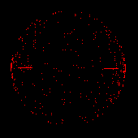
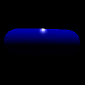

# the large pixel collider

[![Build Status][travis_image]][travis_status]

The **large pixel collider** is a proof-of-concept graphics engine, implemented in `C`. The following sample animations
display some of its functionality:

---

### compilation/installation
 * `make all`, or `./large_pixel_collider` : compile the engine.
 * `make test`, or `./large_pixel_collider --test` : run unit tests
 * `make run` : render a sample animation.
 * `make run SCRIPT_FILE=path/to/script`, or `./large_pixel_collider --script /path/to/script` :
    execute the contents of a script file.
 * `make clean` : delete compiled binaries
 * `make install` : install all of the engine's dependencies, which are:
	* [SDL][SDL]
	* [ncurses][ncurses]
	* [Xlib][Xlib]

You can also invoke the executable directly, with:
 *  : run a sample animation.
 * : run unit-tests
 * : run unit-tests

### features
This project implements a rudimentary graphics engine from the ground up, using
the `SDL` graphics library only for per-pixel access. The following algorithms
and features are included:

 * Bresenham line rasterization
 * translations, scaling, rotations
 * Bezier/Hermite curves
 * shape creation: spheres, tori, rectangular prisms
 * backface culling
 * scanline fills
 * z-buffering
 * a custom scripting language, `MDL`, with a `Lex`/`Yacc`parser and
    interpreter
 * Goraud shading
 * a unit-testing suite

### use
##### basics
From the project root, run `make install`, and `make all`. When the engine finishes compilation, run `make test` to
execute the engine's full suite of unit-tests: make sure they all succeeded! Then, run `make run` to see a sample
animation.

##### more
Beyond the compiled animation displayed by `make run`, check out the following:

 * **animations**: the engine comes pre-packaged with animation `gif`s inside `animations/`, which display some of its
   functionality.
 * **scripting**: the engine has its own scripting language, `MDL`, which allows you to toy with its numerous features.
   Read on for more details.

### scripting
The engine's scripts are written in a language called `MDL`, which consists of commands written on individual lines. A
simple script might look like:

	// A sample script that creates a sphere, then rotates, scales, and translates it.

	frames 40
	rotate x 45
	move 10 30 40
	scale 2 2 2
	sphere 0 0 0 50
	display

#### commands

**Note on notation**: all command prototypes will take the following form: `command [args]`. `[args]` will be a space
and/or pipe separated list.
 * `a b` means there are two arguments, `a` and `b`
 * `a|b` indicates that only one argument, either `a` or `b`, is necessary
 * `[a]` indicates that `a` is optional.

###### general commands
command | description
--- | ---
`display` | displays the image generated by the script thus far.
`save filename` | saves the image to a `bmp` file named `filename`.
`frames number` | execute the script over `number` frames.
`vary modifier frame_begin frame_end val_begin val_end` | Varies `modifier` from value `val_begin` to `val_end` over the span of frames `frame_begin` to `frame_end`.
`//` | a comment

###### transformations
Transformations are a bit tricky. The engine maintains a stack of transformation matrices: `move`, `rotate`, and
`scale` all create transformations which are multiplied into the current top of the transformation matrix. `pop` will
remove the top matrix, and `push` will duplicate it (creating a copy and pushing it onto the stack).  Whenever a shape
is created, it is transformed against the current top of the transformation matrix. Clever use of `push` and `pop` lets
you "cascade" transformations: an arm with an attached hand can be angled outward, the hand can be rotated, and each of
the fingers can then be angled down, while still maintaining the logical structure of the arm.  Without the stack
mechanism, all of the components would undergo the same transformations and the resultant object wouldn't resemble an
arm at all (its parts probably scattered across the screen)!

The optional argument `modifier` appended to the following prototypes is any variable previously declared with the
`vary` command.

command | description
--- | ---
`pop` | pops the top matrix off the transformation stack.
`push` | pushes a copy of the top matrix of the transformation stack onto the stack.
`move x y z [modifier]` | adds a translation of (`x`, `y`, `z`) units.
<code>rotate x&#124;y&#124;z degrees [modifier]</code> | adds a rotation of `degrees` degrees through the `x`, `y`, or `z` axes.
`scale x y z [modifier]` | adds a scale of (`x`, `y`, `z`) units.

###### object creation
command | description
--- | ---
`box x y z h w d` | adds a rectangular prism with top-left-front corner at (`x`, `y`, `z`), and height `h`, width `w`, and depth `d`.
`torus x y z r0 r1` | adds a torus with centroid (`x`, `y`, `z`), minor radius `r0` and major radius `r1`.
`sphere x y z r` | adds a sphere centered on (`x`, `y`, `z`)

#### mechanics
An `MDL` script is executed over a given number of frames, which must be specified at the beginning of the script with
the `frame` command. `vary` commands are used to change the value of `modifiers`, which can be used to amplify
transformations, from one value to another over a given range of frames.

After the `frame` and `vary` commands are interpreted, the remainder of the script is executed once per frame, with
different modifier values that change the resultant image.

#### Example
	// display a torus spinning 360 degrees through the z-axis.
	frames 360
	vary angle 0 359 0 1

	rotate z 360 angle
	torus 0 0 0 50 100
	display

[SDL]: http://www.libsdl.org/
[ncurses]: http://www.gnu.org/software/ncurses/
[Xlib]:http://en.wikipedia.org/wiki/Xlib
[travis_status]: (https://travis-ci.org/sevko/graphics-engine)
[travis_image]: https://travis-ci.org/sevko/large-pixel-collider.svg
